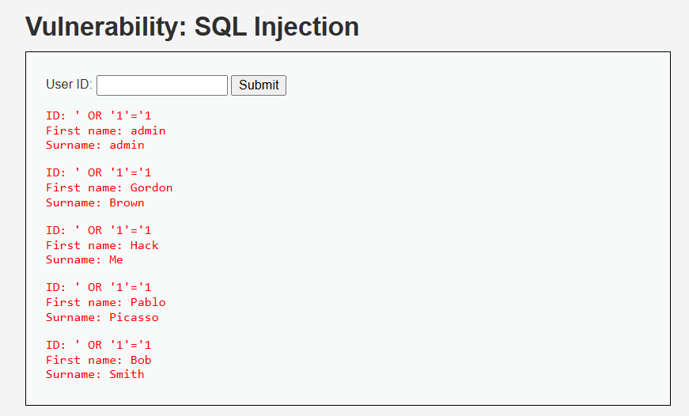
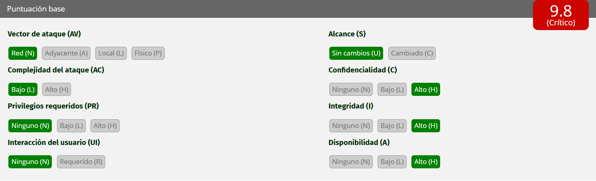

# Análisis de Vulnerabilidad: Inyección SQL (SQLi)

**Organización:** Aguas Claras (Sanitaria / Servicios Básicos)  
**Activo Auditado:** Portal de Clientes

## 1. Evidencia de la Explotación

*(Captura que demuestra el volcado no autorizado de la base de datos al manipular el campo de búsqueda).*

---

## 2. Por qué funciona la vulnerabilidad

La vulnerabilidad de **Inyección SQL (SQLi)** presente en el portal funciona debido a una falla crítica en la validación de las entradas de los usuarios. Actualmente, la aplicación web toma el texto exacto que se escribe en el campo "User ID" y lo concatena directamente dentro de una consulta estructurada dirigida a la base de datos, sin ningún filtro o "sanitización".

Al introducir el payload malicioso `' OR '1'='1`:
1. El primer apóstrofe (`'`) "cierra" prematuramente el texto que la base de datos esperaba recibir.
2. La instrucción `OR '1'='1'` añade una operación lógica matemática que **siempre es verdadera**.
3. El motor de la base de datos procesa la orden modificada y, en lugar de buscar a un solo cliente, evalúa la condición verdadera y devuelve **todos los registros de la tabla**.

En el contexto de nuestra empresa sanitaria, este fallo no es solo un error de código, es una brecha catastrófica. Permite que un tercero malintencionado obtenga acceso completo a la base de datos, exponiendo RUTs, direcciones de suministro, historiales de consumo de agua y los datos de pago/facturación de miles de clientes, quebrando la confidencialidad de nuestro servicio.

---

## 3. Puntaje y severidad CVSS

Utilizando el estándar de la industria (Common Vulnerability Scoring System v3.1) para dimensionar el riesgo de esta vulnerabilidad en Aguas Claras:

* **Vector:** `CVSS:3.1/AV:N/AC:L/PR:N/UI:N/S:U/C:H/I:H/A:H`
* **Puntaje Base:** **9.8**
* **Severidad:** **CRÍTICA**

**Justificación de la métrica:**
Es un ataque que se lanza remotamente por internet (`AV:N`), de complejidad baja (`AC:L`), que no requiere usuario ni contraseña previa (`PR:N`) y no necesita que la víctima interactúe (`UI:N`). Al permitir la extracción, alteración (modificar cuentas de agua) y posible destrucción de las bases de datos de clientes, el impacto en Confidencialidad, Integridad y Disponibilidad es total (`C:H/I:H/A:H`).

---

## 4. Política de prevención y control de mitigación

Para salvaguardar los activos de información de la empresa, se deben adoptar las siguientes medidas inmediatas y a largo plazo:

## 5. Políticas de Prevención (Corrección de Raíz)
El equipo de desarrollo debe estandarizar prácticas de codificación segura para evitar que la aplicación sea vulnerable por diseño:
* **Consultas Parametrizadas (Prepared Statements):** Es la solución definitiva. Obliga al sistema a tratar la entrada del usuario estrictamente como *datos* (texto plano), despojándola de cualquier capacidad de ejecutarse como comando SQL.
* **Validación de Tipos (Whitelisting):** Si el sistema espera un ID numérico, el código debe rechazar automáticamente cualquier entrada que contenga letras o símbolos especiales.

## 6. Controles de Mitigación (Defensa Perimetral)
Mientras se aplican los parches en el código fuente, la infraestructura de Aguas Claras debe blindarse mediante controles técnicos compensatorios:
* **Web Application Firewall (WAF):** Activar un WAF para inspeccionar el tráfico entrante. Este interceptará y bloqueará automáticamente peticiones que contengan firmas típicas de Inyección SQL (como secuencias de apóstrofes o comandos lógicos `OR 1=1`).
* **Principio de Mínimo Privilegio en la Base de Datos:** Restringir drásticamente los permisos del usuario de base de datos que usa el portal web. Si el portal solo necesita "leer" saldos o "insertar" registros de pago, jamás debe tener privilegios para "borrar" tablas o acceder a esquemas administrativos de la sanitaria.

