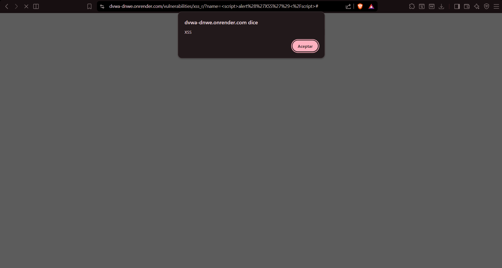
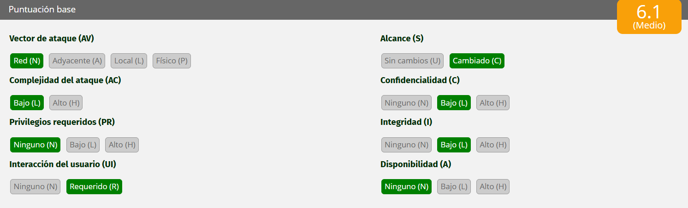

# Análisis de Vulnerabilidad: Cross-Site Scripting (XSS Reflejado)

**Organización:** Aguas Claras (Sanitaria / Servicios Básicos)  
**Activo Auditado:** Portal de Clientes

## 1. Evidencia de la Explotación

*(Captura de pantalla mostrando la ejecución de un script emergente en el navegador, producto de la inyección de código malicioso en la URL del portal).*

---

## 2. Por qué funciona la vulnerabilidad (Explicación técnica)

La vulnerabilidad detectada corresponde a **Cross-Site Scripting (XSS) en su variante Reflejada**. Esta falla ocurre porque el portal de Aguas Claras recibe un dato enviado por el usuario (en este caso, a través de la URL de la página web) y lo "refleja" o imprime de vuelta en la respuesta HTML exactamente como fue recibido, sin aplicarle ningún tipo de limpieza, filtrado o codificación (sanitización).

Al ingresar el payload ``, el servidor no reconoce que esto es código potencialmente peligroso; simplemente lo devuelve incrustado en la página. Como resultado, el navegador web de la víctima interpreta esas etiquetas como instrucciones de JavaScript válidas y las ejecuta inmediatamente.

**Impacto en el Negocio de Aguas Claras:** A diferencia de la Inyección SQL que ataca directamente los servidores de la empresa, el XSS ataca a los **clientes** de la sanitaria. Un ciberdelincuente podría enviar un enlace fraudulento del portal oficial de Aguas Claras (por ejemplo, en un correo masivo de *phishing* sobre un "aviso falso de corte de agua"). Si el cliente hace clic en el enlace manipulado, el script malicioso se ejecuta en su navegador, permitiendo al atacante robar sus *cookies* de sesión (secuestro de cuenta), redirigirlo a una pasarela de pagos falsa para robar su tarjeta de crédito, o realizar acciones no autorizadas en su cuenta de cliente.

---

## 3. Puntaje y severidad CVSS

Evaluando el impacto bajo el estándar CVSS v3.1:

* **Vector:** `CVSS:3.1/AV:N/AC:L/PR:N/UI:R/S:C/C:L/I:L/A:N`
* **Puntaje Base:** **6.1**
* **Severidad:** **MEDIA**

**Justificación de la métrica:**
El ataque se ejecuta a través de la red (`AV:N`) con baja complejidad (`AC:L`) y sin requerir privilegios o autenticación previa (`PR:N`). Sin embargo, a diferencia del SQLi, el XSS reflejado **requiere interacción del usuario** (`UI:R`), ya que la víctima debe hacer clic en el enlace manipulado. El alcance cambia (`S:C`) porque el ataque vulnera el navegador del cliente y no la infraestructura del servidor de Aguas Claras. Esto impacta parcialmente la confidencialidad (posible robo de sesión) y la integridad (modificación visual de la web o redirección) (`C:L/I:L`), pero no afecta la disponibilidad del portal (`A:N`).

---

## 4. Política de prevención y control de mitigación

Para proteger la integridad de los clientes del portal sanitario, se deben implementar las siguientes directrices técnicas:

### 3.1.4 Políticas de Prevención (Corrección de Raíz)
* **Codificación de Salida (Output Encoding):** Es el mecanismo principal de defensa. El equipo de desarrollo debe garantizar que cualquier dato variable que provenga de una petición (URL, formulario, etc.) sea codificado en formato de entidades HTML antes de mostrarse en pantalla. Por ejemplo, transformar el carácter `<` en `&lt;` y `>` en `&gt;`. De esta manera, el navegador mostrará el código como texto inofensivo, pero jamás lo ejecutará.
* **Validación de Entrada estricta:** Implementar listas blancas de caracteres. El portal debe rechazar caracteres especiales no válidos (como etiquetas HTML) en aquellos parámetros donde lógicamente solo se espera recibir texto alfanumérico o nombres comunes.

### 3.1.5 Controles de Mitigación (Defensa Perimetral)
* **Implementar Content Security Policy (CSP):** Configurar las cabeceras HTTP de seguridad CSP en el servidor de Aguas Claras. Esta política instruye al navegador del cliente de forma estricta sobre qué fuentes de código son confiables, prohibiendo explícitamente la ejecución de scripts *inline* (que es exactamente lo que hace este ataque).
* **Atributos de seguridad en Cookies:** Todas las cookies de sesión del portal deben configurarse obligatoriamente con el atributo `HttpOnly`. Este atributo impide que lenguajes de scripting del lado del cliente (como el JavaScript inyectado en un ataque XSS) puedan acceder al valor de la cookie, neutralizando el riesgo de secuestro de cuenta.

