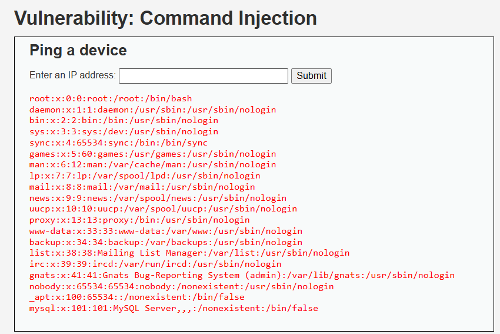

# Análisis de Vulnerabilidad: Inyección de Comandos (Command Injection)

**Organización:** Aguas Claras (Sanitaria / Servicios Básicos)  
**Activo Auditado:** Portal de Clientes

## 1. Evidencia de la Explotación

*(Captura de pantalla documentando la ejecución arbitraria de comandos a nivel de servidor, evidenciada por la lectura no autorizada del archivo de usuarios del sistema `/etc/passwd`).*

---

## 2. Por qué funciona la vulnerabilidad (Explicación técnica)

La vulnerabilidad de **Inyección de Comandos (Command Injection)** se presenta porque el portal web toma los datos introducidos por el usuario y los transfiere directamente a la consola del sistema operativo (shell) para su ejecución, omitiendo cualquier tipo de validación, filtrado o limpieza.

En este escenario, la aplicación web de Aguas Claras fue diseñada para recibir una dirección IP y ejecutar un simple comando de diagnóstico de red (`ping`). Sin embargo, al introducir el payload `127.0.0.1; cat /etc/passwd`, el atacante abusa del carácter punto y coma (`;`), el cual actúa como un separador de comandos en sistemas Linux/Unix. El servidor procesa la instrucción como dos órdenes independientes: primero realiza el ping a la IP local, e inmediatamente después ejecuta el comando `cat`, revelando la lista de usuarios del sistema operativo.

**Impacto en el Negocio de Aguas Claras:** Esta es la vulnerabilidad más crítica del reporte. No se limita a la base de datos o al navegador del cliente; el atacante ha logrado saltarse las barreras de la aplicación y comprometer el servidor físico o virtual que aloja el portal de Aguas Claras. A partir de aquí, un delincuente informático podría tomar control total del servidor, utilizarlo como puente para infiltrarse en la red interna de la sanitaria (sistemas de facturación profunda, o infraestructuras de control industrial SCADA), e incluso paralizar los servicios digitales de la empresa, generando una crisis operacional.

---

## 3. Puntaje y severidad CVSS

Dimensionando el riesgo de esta vulnerabilidad bajo el estándar CVSS v3.1:

* **Vector:** `CVSS:3.1/AV:N/AC:L/PR:N/UI:N/S:C/C:H/I:H/A:H`
* **Puntaje Base:** **10.0**
* **Severidad:** **CRÍTICA**

**Justificación de la métrica:**
El ataque es explotable remotamente por internet (`AV:N`), no requiere condiciones de red complejas (`AC:L`), ni de una cuenta registrada (`PR:N`) o interacción de terceros (`UI:N`). El alcance cambia dramáticamente (`S:C`) porque el ataque salta del entorno delimitado de la aplicación web a comprometer la infraestructura subyacente (el sistema operativo). Al permitir la ejecución de cualquier orden con los privilegios del servicio web, el atacante puede leer todo (Confidencialidad), modificar todo (Integridad) y destruir el servidor (Disponibilidad), obteniendo la máxima puntuación en estos tres pilares (`C:H/I:H/A:H`).

---

## 4. Política de prevención y control de mitigación

Para resguardar la infraestructura de la sanitaria y neutralizar esta amenaza, se deben ejecutar los siguientes lineamientos técnicos:

### 3.1.4 Políticas de Prevención (Corrección de Raíz)
* **Evitar llamadas directas al Sistema Operativo:** El equipo de desarrollo tiene estrictamente prohibido utilizar funciones del lenguaje de programación (como `exec()`, `system()` o `shell_exec()`) para invocar comandos externos. Deben utilizarse en su lugar las bibliotecas nativas y seguras del lenguaje de programación (APIs) que realizan la misma función sin invocar una shell (por ejemplo, usar librerías de red específicas para hacer el ping).
* **Validación de Entrada Extrema (Whitelisting):** Si es absolutamente inevitable usar una entrada del usuario en un comando del sistema, el portal debe validar que el formato de los datos sea estrictamente el esperado. En este caso, solo debe aceptar números y puntos que coincidan con la estructura matemática de una dirección IPv4, rechazando de plano cualquier símbolo asociado a operaciones de consola (`;`, `&`, `|`, `$`, `` ` ``).

### 3.1.5 Controles de Mitigación (Defensa Perimetral)
* **Principio de Menor Privilegio en el Servidor (Sandboxing):** El servicio web del portal de Aguas Claras (ej. Apache, Nginx) debe ejecutarse bajo un usuario del sistema operativo con privilegios mínimos. No debe tener permisos de lectura sobre archivos sensibles del sistema (como el expuesto `/etc/passwd` o `/etc/shadow`) ni permisos para instalar binarios. Se recomienda aislar el servicio web mediante contenedores (como Docker) o entornos chroot.
* **Web Application Firewall (WAF) Activo:** Mantener estrictas reglas en el WAF que detecten e intercepten firmas de Inyección de Comandos (como el uso de metacaracteres o intentos de encadenamiento de comandos Unix/Windows) antes de que estas peticiones alcancen el servidor de Aguas Claras.

